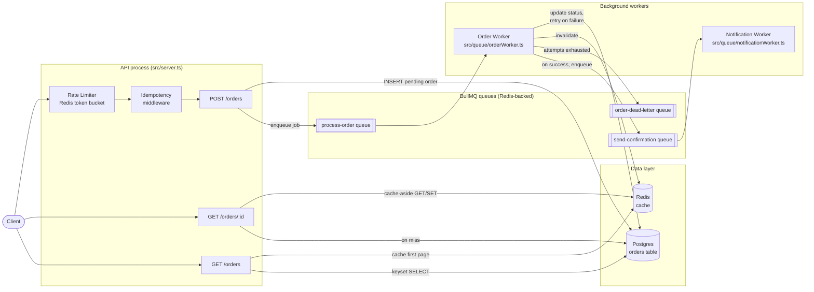

# Distributed Order Processing System

A small but "production-shaped" order processing API. It exists to demonstrate a
set of distributed-systems concerns end-to-end in one working codebase, rather
than each in an isolated toy example:

- **Caching** — Redis cache-aside for single-order reads and the hot first page of a list.
- **Rate limiting** — atomic Redis Lua token bucket, per-client.
- **Message queue** — BullMQ (Redis-backed) decouples order creation from processing.
- **At-least-once delivery + retries** — exponential backoff, idempotent job handler, dead-letter queue.
- **Idempotency** — `Idempotency-Key` header makes retried `POST /orders` calls safe.
- **Pagination at scale** — keyset (cursor) pagination, not `OFFSET`.
- **Background jobs** — a worker process, decoupled from the API, chained into a second notification job.
- **Tests + CI** — unit tests (mocked Redis) and integration tests (real Postgres + Redis via GitHub Actions service containers).

## Architecture



**Request flow for `POST /orders`:**

1. Rate limiter checks the client's token bucket (Redis, atomic Lua script). Over budget → `429`.
2. Idempotency middleware checks for an `Idempotency-Key` header. First time seen → acquire a lock and proceed. Seen before with the same body → replay the original response. Seen before with a different body → `422`. Currently in-flight → `409`.
3. The order is inserted into Postgres with `status = 'pending'` and the API immediately enqueues a `process-order` job — it does **not** call the payment provider inline, so a slow/flaky downstream dependency can't make the API itself slow or flaky.
4. API responds `202 Accepted` with the order (still pending). The client polls `GET /orders/:id` or would be notified via webhook in a fuller system.
5. The **order worker**, running as a separate process, picks up the job, calls the (simulated) payment provider, and updates the order's status. On failure it throws, which causes BullMQ to retry with exponential backoff, up to `MAX_JOB_ATTEMPTS`. After the last attempt fails, the order is marked `dead_letter` and the job payload is copied onto an explicit dead-letter queue for inspection/replay.
6. On success, the worker invalidates the Redis cache entries for that order and enqueues a `send-confirmation` job onto a second queue, which a separate **notification worker** consumes — demonstrating a chained, multi-stage background pipeline rather than one monolithic job.

## Why these specific design choices

<details>
<summary><b>Why keyset pagination instead of <code>OFFSET</code>?</b></summary>

`OFFSET 10000 LIMIT 20` forces Postgres to scan and discard 10,000 rows on every request for page 501, and results can shift under you if rows are inserted while paginating. Keyset pagination (`WHERE (created_at, id) < ($1, $2) ORDER BY created_at DESC, id DESC LIMIT N`) seeks directly to the right place using the `idx_orders_created_at_id` composite index — flat performance no matter how deep you page, and stable under concurrent writes. See `src/services/orderService.ts`.
</details>

<details>
<summary><b>Why a Lua script for rate limiting?</b></summary>

A naive `GET tokens → check → SET tokens` from application code is a check-then-act race: two concurrent requests can both read "1 token left" and both be let through. Running the whole read-modify-write as one Redis `EVAL` makes it atomic. See `src/middleware/rateLimiter.ts`.
</details>

<details>
<summary><b>Why is the idempotency key a Redis lock, not just a DB unique constraint?</b></summary>

A unique constraint on `idempotency_key` (which this schema also has, as a belt-and-suspenders safety net) only prevents duplicate *writes* — it doesn't let you return the *same response* to a client that's retrying a request whose first attempt is still in flight, and a bare `INSERT ... ON CONFLICT` can't distinguish "same key, same payload, safe to replay" from "same key, different payload, client bug." The middleware in `src/middleware/idempotency.ts` handles all three of those cases explicitly.
</details>

<details>
<summary><b>What does "at-least-once delivery" actually mean here, concretely?</b></summary>

BullMQ persists a job in Redis before the API call returns, and only removes it once the worker acknowledges completion. If a worker process dies mid-job, the lock on that job expires and another worker instance will pick it up again — so the same job can, in rare cases, be processed more than once. That's why the worker's handler in `src/queue/orderWorker.ts` starts by checking `if (existing.status === 'completed') return` — the operation is made idempotent per `orderId` so redelivery is safe rather than double-charging a customer.
</details>

## Project layout

```
src/
  app.ts                  Express app factory (dependency-injected, testable)
  server.ts               Process entrypoint for the API
  config.ts               Environment-driven configuration
  db.ts / redis.ts        Postgres pool / Redis client singletons
  middleware/
    rateLimiter.ts         Token-bucket rate limiting (Lua script)
    idempotency.ts         Idempotency-Key handling
  routes/orders.ts         HTTP handlers
  services/orderService.ts DB access + keyset pagination
  queue/
    orderQueue.ts          BullMQ queue producers
    orderWorker.ts         Order-processing worker (retries, backoff, DLQ)
    notificationWorker.ts  Second worker, chained from the first
migrations/001_init.sql   Schema + pagination index
tests/
  unit/                    Fast tests against ioredis-mock / mocked Pool
  integration/             Full HTTP tests against real Postgres + Redis
.github/workflows/ci.yml  Lint -> build -> migrate -> unit -> integration -> docker build
```

## Running locally

```bash
cp .env.example .env
docker compose up --build
```

This starts Postgres, Redis, runs migrations, and brings up the API (`:3000`), the order worker, and the notification worker.

Try it:

```bash
curl -X POST http://localhost:3000/orders \
  -H 'Content-Type: application/json' \
  -H 'Idempotency-Key: demo-key-1' \
  -d '{"customer_email":"you@example.com","item":"Keyboard","quantity":1,"amount_cents":8900}'

curl http://localhost:3000/orders/<id-from-response>
curl http://localhost:3000/orders?limit=10
```

### Running without Docker

You'll need a local Postgres and Redis reachable at the URLs in `.env`.

```bash
npm install
npm run migrate
npm run dev            # API, with reload
npm run dev:worker      # in a second terminal
```

## Tests

```bash
npm run test:unit         # fast, no external services (uses ioredis-mock)
npm run test:integration  # needs Postgres + Redis running (docker compose up postgres redis)
npm test                  # both
```

CI runs both suites against real Postgres/Redis service containers on every push — see `.github/workflows/ci.yml`.

## Deploying

Deploy-ready configs are included for both platforms; you'll need your own account/repo to actually stand up the live instance:

- **Render** — `render.yaml` is a Blueprint: push this repo to your own GitHub, then "New +" → "Blueprint" in the Render dashboard and point it at the repo. It provisions the API, both workers, a Postgres database, and a Redis instance from that one file.
- **Railway** — `railway.json` configures the Docker build for the API service. Create the project from this repo, add a Postgres and a Redis plugin, then add two more services from the same repo with the start command overridden to `node dist/queue/orderWorker.js` and `node dist/queue/notificationWorker.js` respectively.

In both cases, run `npm run migrate` once against the provisioned `DATABASE_URL` (Render/Railway both let you run one-off commands against a deployed service) before the first request.

## API reference

| Method | Path           | Notes |
|--------|----------------|-------|
| `POST` | `/orders`      | Body: `{customer_email, item, quantity, amount_cents}`. Optional `Idempotency-Key` header. Returns `202` with the pending order. |
| `GET`  | `/orders/:id`  | Cache-aside read; `X-Cache: HIT|MISS` response header. |
| `GET`  | `/orders`      | `?limit=20&cursor=...` keyset pagination; response includes `nextCursor`. |
| `GET`  | `/healthz`     | Liveness check. |

## What's intentionally out of scope

This is a focused demo, not a full production system. Left out to keep it readable: authentication/authorization, real payment/email provider integration, multi-region Redis/Postgres, and job-level metrics/observability (structured logs are there, but no Prometheus/Grafana wiring).
